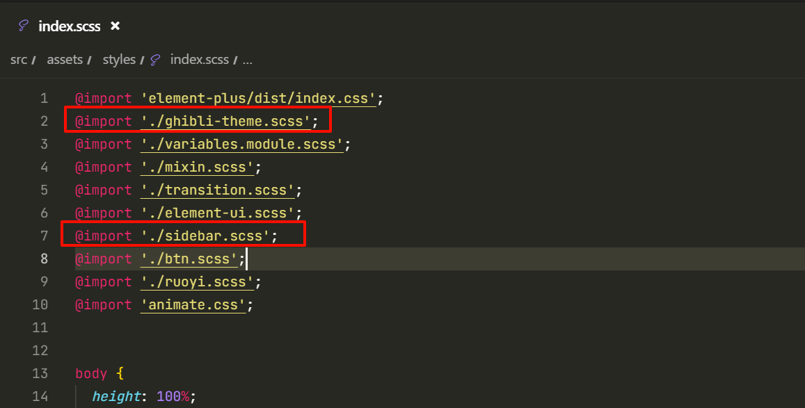
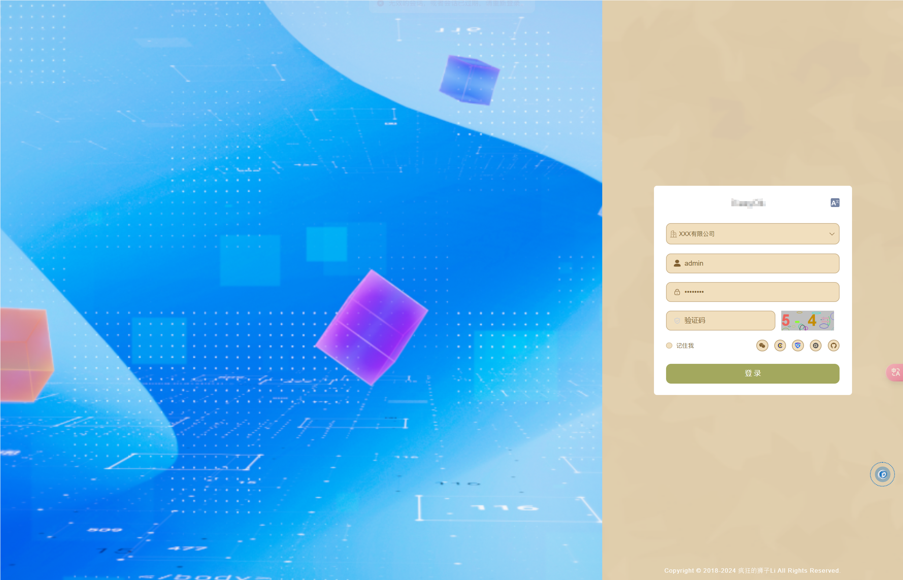
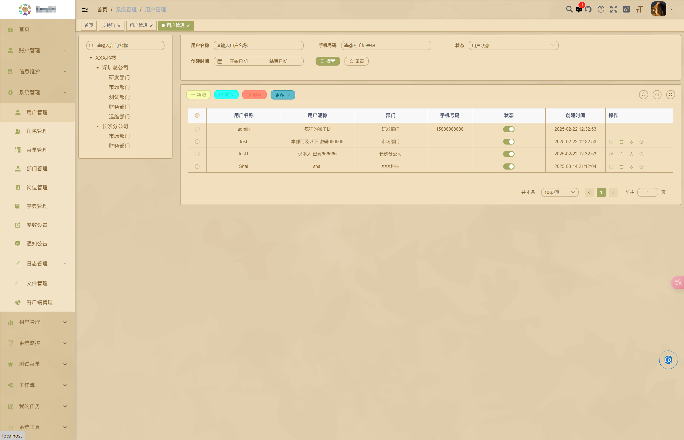
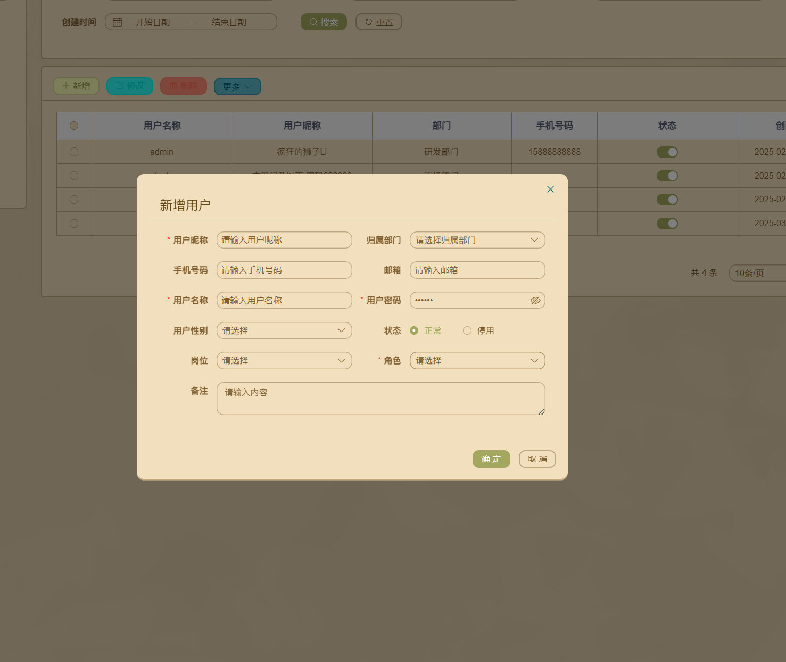
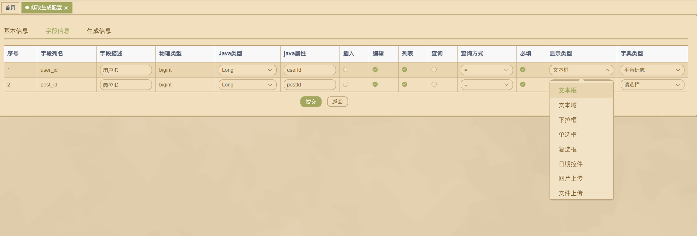

# theme-vue-element

## Ghibli

基于RuoYi-Plus element框架修改，还存在些许bug，显示效果不是很好

RuoYi-Plus：[疯狂的狮子Li (JavaLionLi) - Gitee.com](https://gitee.com/JavaLionLi)

原版主题（基于shadcnui）：[Matsu-theme for shadcn/ui](https://matsu-theme.vercel.app/)

**使用方法：**

